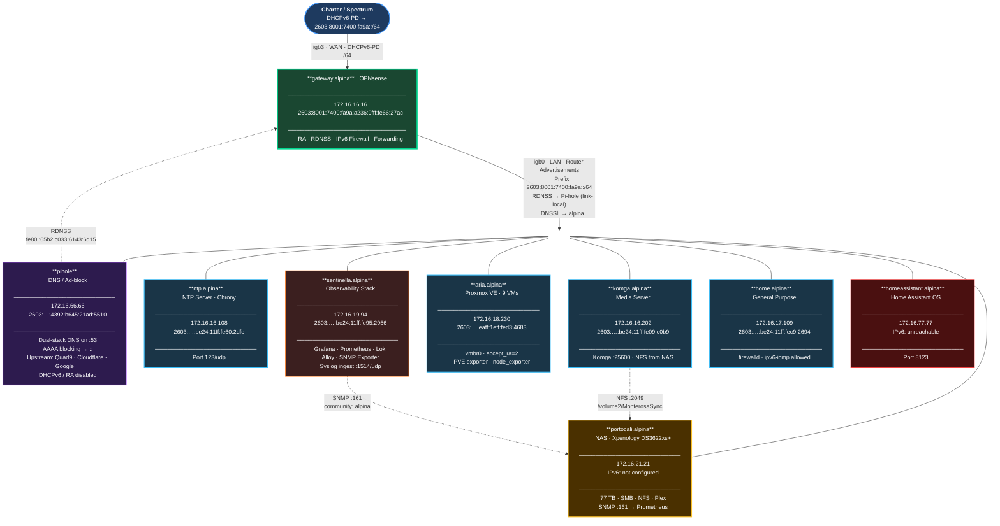
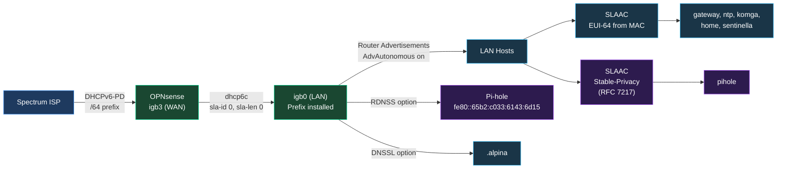
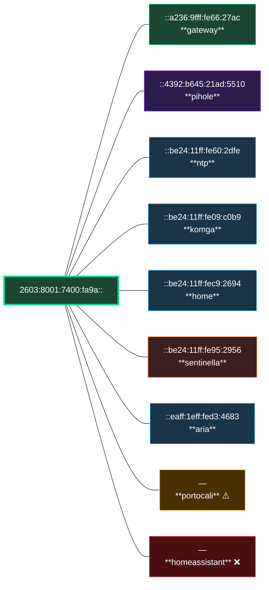
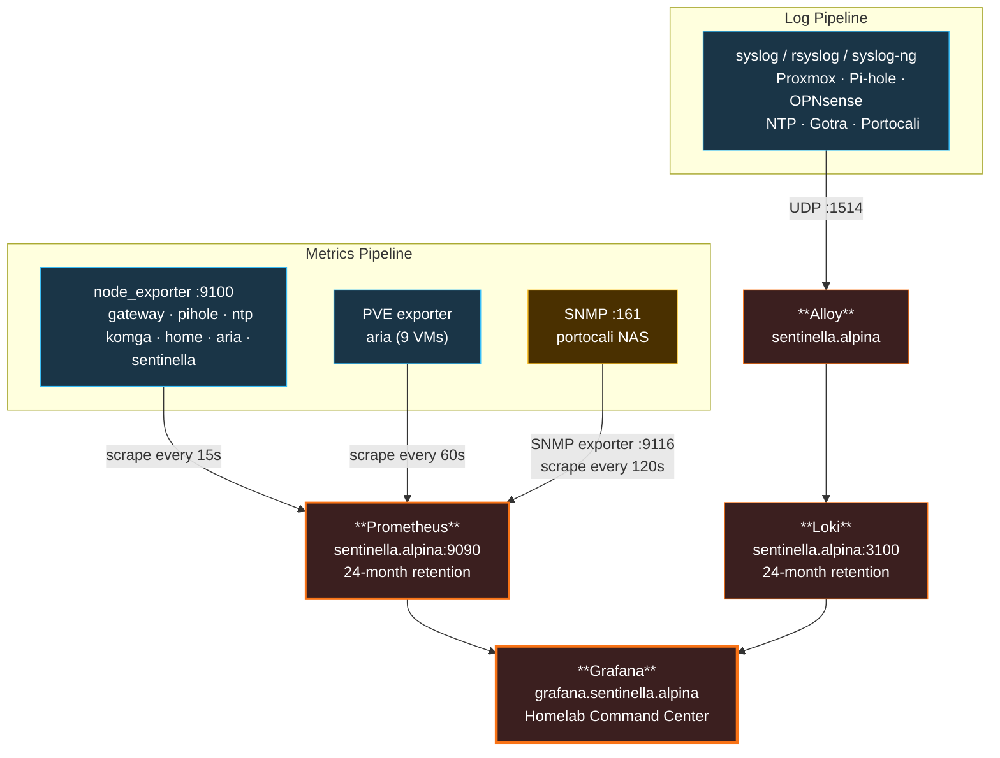
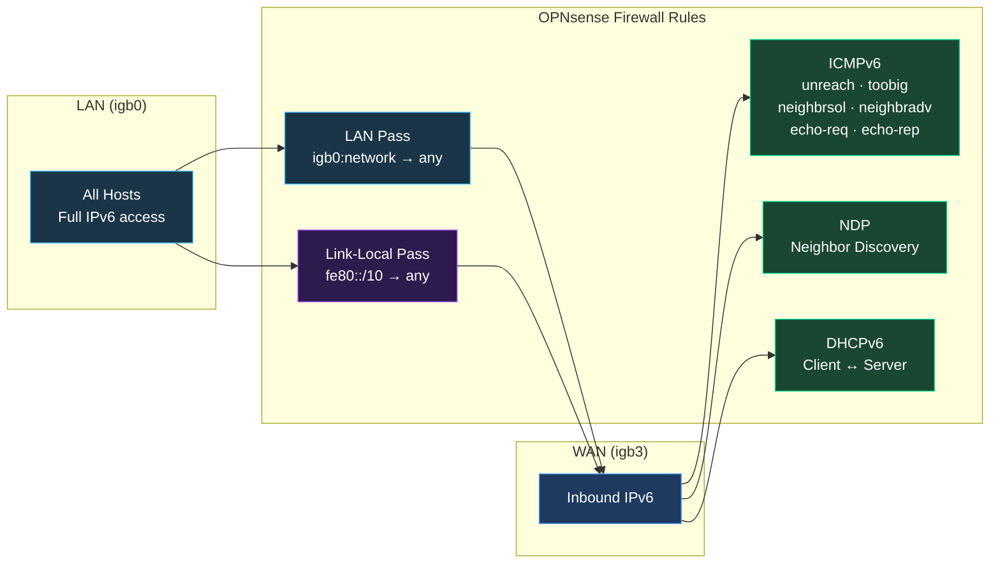

# Alpina Network — IPv6 Topology

> Dual-stack homelab on prefix **`2603:8001:7400:fa9a::/64`** via DHCPv6-PD from Spectrum.
> All addresses assigned via SLAAC with Router Advertisements from OPNsense.

## Network Topology

### Legend

| Color | Meaning |
|-------|---------|
| 🟢 Green border | Gateway — RA source, IPv6 fully operational |
| 🔵 Blue border | Host with working dual-stack IPv6 |
| 🟣 Purple border | DNS infrastructure |
| 🟠 Orange border | Observability stack |
| 🟡 Yellow border | IPv6 not yet configured |
| 🔴 Red border | IPv6 unreachable |

---

## IPv6 Address Assignment Flow

---

## Host IPv6 Address Map

---

## Monitoring & Logging Flows

---

## Firewall — IPv6 Policy

---

## Outstanding Issues

| # | Issue | Impact | Next Step |
|---|-------|--------|-----------|
| 1 | Rogue ULA RAs for `fde6:19bd:3ffd::/64` from 4 unknown MACs | Low (router-lifetime=0) | Identify devices by MAC, disable RA |
| 2 | `homeassistant.alpina` has no global IPv6 | HAOS not dual-stack | Investigate HAOS IPv6 support |
| 3 | `portocali.alpina` NAS not on IPv6 | NAS IPv4-only | Configure in DSM network settings |
| 4 | Single /64 prefix limits future VLANs | No subnet segmentation | Request /56 from Spectrum |
