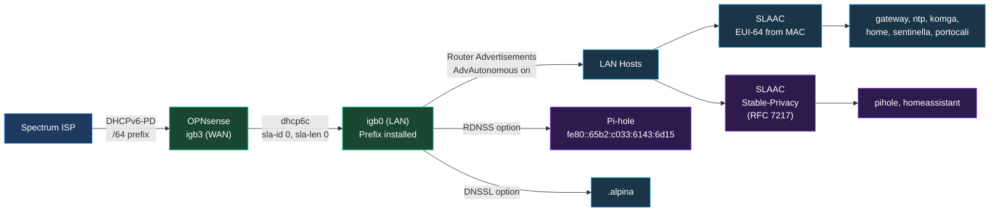
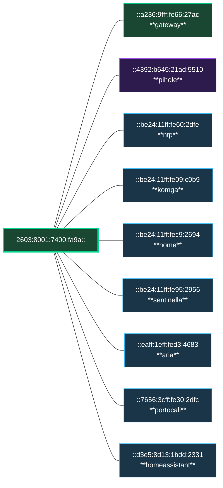

# Alpina Network — IPv6 Topology

> Dual-stack homelab on prefix **`2603:8001:7400:fa9a::/64`** via DHCPv6-PD from Spectrum.
> All addresses assigned via SLAAC with Router Advertisements from OPNsense.

## Network Topology

```mermaid
graph TD
    ISP@{ shape: stadium, label: "**Charter / Spectrum**
    DHCPv6-PD → 2603:8001:7400:fa9a::/64" }

    ISP -- "igb3 · WAN · DHCPv6-PD /64" --> GW

    GW["**gateway.alpina** · OPNsense
    ─────────────────────────────
    172.16.16.16
    2603:8001:7400:fa9a:a236:9fff:fe66:27ac
    ─────────────────────────────
    RA · RDNSS · IPv6 Firewall · Forwarding
    Suricata IDS (LAN+WAN)"]

    GW -- "igb0 · LAN · Router Advertisements
    Prefix 2603:8001:7400:fa9a::/64
    RDNSS → Pi-hole (link-local)
    DNSSL → alpina" --> SW[ ]

    SW --- DNS
    SW --- NTP
    SW --- MON
    SW --- PROX
    SW --- KOMGA
    SW --- HOME
    SW --- NAS
    SW --- HAOS

    DNS["**pihole**
    DNS / Ad-block
    ─────────────────────────
    172.16.66.66
    2603:…:4392:b645:21ad:5510
    ─────────────────────────
    Dual-stack DNS on :53
    AAAA blocking → ::
    Upstream: Quad9 · Cloudflare · Google
    DHCPv6 / RA disabled"]

    NTP["**ntp.alpina**
    NTP Server · Chrony
    ─────────────────────────
    172.16.16.108
    2603:…:be24:11ff:fe60:2dfe
    ─────────────────────────
    Port 123/udp"]

    MON["**sentinella.alpina**
    Observability Stack
    ─────────────────────────
    172.16.19.94
    2603:…:be24:11ff:fe95:2956
    ─────────────────────────
    Grafana · Prometheus · Loki
    Alloy · SNMP Exporter
    Syslog ingest :1514/udp"]

    PROX["**aria.alpina**
    Proxmox VE · 9 VMs
    ─────────────────────────
    172.16.18.230
    2603:…:eaff:1eff:fed3:4683
    ─────────────────────────
    vmbr0 · accept_ra=2
    PVE exporter · node_exporter"]

    KOMGA["**komga.alpina**
    Media Server
    ─────────────────────────
    172.16.16.202
    2603:…:be24:11ff:fe09:c0b9
    ─────────────────────────
    Komga :25600 · NFS from NAS"]

    HOME["**home.alpina**
    General Purpose
    ─────────────────────────
    172.16.17.109
    2603:…:be24:11ff:fec9:2694
    ─────────────────────────
    firewalld · ipv6-icmp allowed"]

    NAS["**portocali.alpina**
    NAS · Xpenology DS3622xs+
    ─────────────────────────
    172.16.21.21
    2603:…:7656:3cff:fe30:2dfc
    ─────────────────────────
    77 TB · SMB · NFS · Plex
    SNMP :161 → Prometheus"]

    HAOS["**homeassistant.alpina**
    Home Assistant OS · RPi 4
    ─────────────────────────
    172.16.77.77
    2603:…:d3e5:8d13:1bdd:2331
    ─────────────────────────
    Port 8123 · NM/SLAAC"]

    KOMGA -. "NFS :2049
    /volume2/MonterosaSync" .-> NAS

    MON -. "SNMP :161
    community: alpina" .-> NAS

    DNS -. "RDNSS
    fe80::65b2:c033:6143:6d15" .-> GW

    style ISP fill:#1e3a5f,stroke:#4a9eff,color:#fff,stroke-width:2px
    style GW fill:#1a4731,stroke:#00d68f,color:#fff,stroke-width:3px
    style SW fill:none,stroke:none
    style DNS fill:#2d1b4e,stroke:#a855f7,color:#fff,stroke-width:2px
    style NTP fill:#1a3547,stroke:#38bdf8,color:#fff,stroke-width:2px
    style MON fill:#1a3547,stroke:#38bdf8,color:#fff,stroke-width:2px
    style PROX fill:#1a3547,stroke:#38bdf8,color:#fff,stroke-width:2px
    style KOMGA fill:#1a3547,stroke:#38bdf8,color:#fff,stroke-width:2px
    style HOME fill:#1a3547,stroke:#38bdf8,color:#fff,stroke-width:2px
    style NAS fill:#1a3547,stroke:#38bdf8,color:#fff,stroke-width:2px
    style HAOS fill:#1a3547,stroke:#38bdf8,color:#fff,stroke-width:2px
```

### Legend

| Color | Meaning |
|-------|---------|
| 🟢 Green border | Gateway — RA source, IPv6 fully operational |
| 🔵 Blue border | Host with working dual-stack IPv6 |
| 🟣 Purple border | DNS infrastructure |

---

## IPv6 Address Assignment Flow

---

## Host IPv6 Address Map

---

## Monitoring & Logging Flows

```mermaid
flowchart TD
    subgraph Metrics["Metrics Pipeline"]
        NE1["node_exporter :9100
        gateway · pihole · ntp
        komga · home · aria · sentinella"]
        PVE["PVE exporter
        aria (9 VMs)"]
        SNMP["SNMP :161
        portocali NAS"]
    end

    subgraph Logs["Log Pipeline"]
        SYS["syslog / rsyslog / syslog-ng
        Proxmox · Pi-hole · OPNsense
        NTP · Gotra · Portocali"]
        IDS["Suricata IDS EVE
        gateway.alpina (LAN+WAN)
        ~200K rules · Community-ID"]
    end

    NE1 -- "scrape every 15s" --> PROM
    PVE -- "scrape every 60s" --> PROM
    SNMP -- "SNMP exporter :9116
    scrape every 120s" --> PROM

    SYS -- "UDP :1514" --> ALLOY
    IDS -- "syslog (EVE alerts)" --> ALLOY

    PROM["**Prometheus**
    sentinella.alpina:9090
    24-month retention"]
    ALLOY["**Alloy**
    sentinella.alpina"]

    PROM --> GRAF
    ALLOY --> LOKI
    LOKI --> GRAF

    LOKI["**Loki**
    sentinella.alpina:3100
    24-month retention"]

    GRAF["**Grafana**
    grafana.sentinella.alpina
    Homelab Command Center"]

    style NE1 fill:#1a3547,stroke:#38bdf8,color:#fff
    style PVE fill:#1a3547,stroke:#38bdf8,color:#fff
    style SNMP fill:#1a3547,stroke:#38bdf8,color:#fff
    style SYS fill:#1a3547,stroke:#38bdf8,color:#fff
    style IDS fill:#4a1a1a,stroke:#ef4444,color:#fff,stroke-width:2px
    style PROM fill:#3b1f1f,stroke:#f97316,color:#fff,stroke-width:2px
    style ALLOY fill:#3b1f1f,stroke:#f97316,color:#fff
    style LOKI fill:#3b1f1f,stroke:#f97316,color:#fff
    style GRAF fill:#3b1f1f,stroke:#f97316,color:#fff,stroke-width:3px
```

---

## Firewall — IPv6 Policy

```mermaid
flowchart LR
    subgraph WAN["WAN (igb3)"]
        IN6["Inbound IPv6"]
    end

    subgraph Rules["OPNsense Firewall Rules"]
        ICMP["ICMPv6
        unreach · toobig
        neighbrsol · neighbradv
        echo-req · echo-rep"]
        NDP["NDP
        Neighbor Discovery"]
        DHCP6["DHCPv6
        Client ↔ Server"]
        LANPASS["LAN Pass
        igb0:network → any"]
        LL["Link-Local Pass
        fe80::/10 → any"]
    end

    subgraph LAN6["LAN (igb0)"]
        HOSTS["All Hosts
        Full IPv6 access"]
    end

    IN6 --> ICMP
    IN6 --> NDP
    IN6 --> DHCP6
    HOSTS --> LANPASS
    HOSTS --> LL
    LANPASS --> IN6
    LL --> IN6

    style IN6 fill:#1e3a5f,stroke:#4a9eff,color:#fff
    style ICMP fill:#1a4731,stroke:#00d68f,color:#fff
    style NDP fill:#1a4731,stroke:#00d68f,color:#fff
    style DHCP6 fill:#1a4731,stroke:#00d68f,color:#fff
    style LANPASS fill:#1a3547,stroke:#38bdf8,color:#fff
    style LL fill:#2d1b4e,stroke:#a855f7,color:#fff
    style HOSTS fill:#1a3547,stroke:#38bdf8,color:#fff
```

---

## Outstanding Issues

| # | Issue | Impact | Next Step |
|---|-------|--------|-----------|
| 1 | Rogue ULA RAs for `fde6:19bd:3ffd::/64` from 4 unknown MACs | Low (router-lifetime=0) | Identify devices by MAC, disable RA |
| ~~2~~ | ~~`homeassistant.alpina` has no global IPv6~~ | ~~Resolved~~ | ~~HAOS already had SLAAC via NetworkManager~~ |
| ~~3~~ | ~~`portocali.alpina` NAS not on IPv6~~ | ~~Resolved~~ | ~~IPv6 enabled in DSM~~ |
| 4 | Single /64 prefix limits future VLANs | No subnet segmentation | Request /56 from Spectrum |
| 5 | Suricata IDS in detect-only mode | Alerts but doesn't block | Run IDS 2-3 weeks, tune FPs, then consider IPS |
| 6 | Suricata 6.0.15 (OPNsense 23.7) | Missing Suricata 7 features | Upgrade OPNsense when ready |
| 7 | `emerging-trojan.rules` unavailable | ET Open limitation | Requires ET Pro subscription (optional) |
